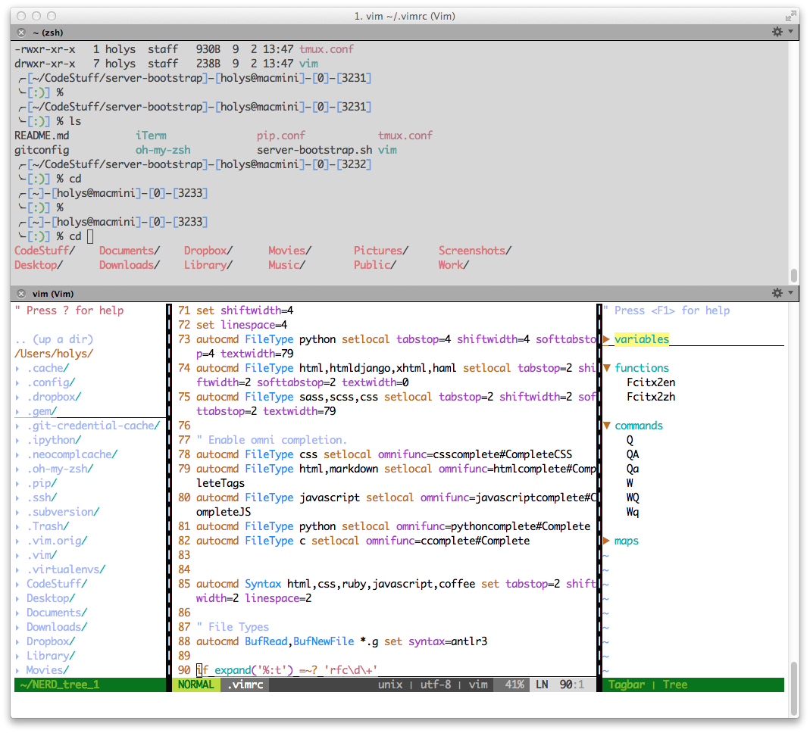
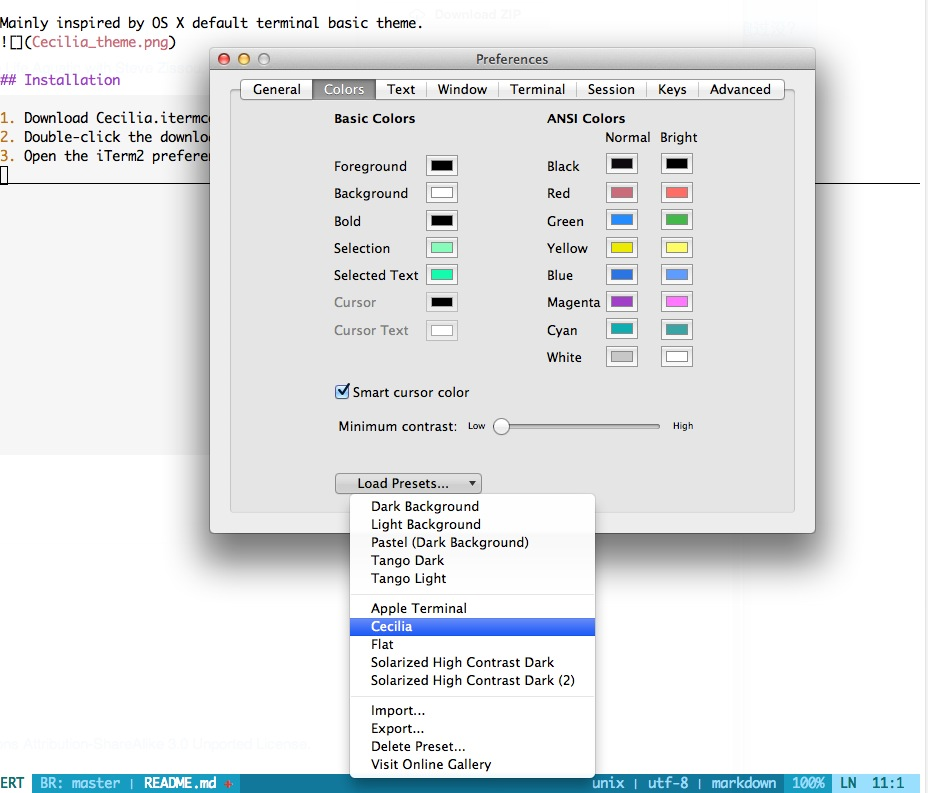

# Cecilia for iTerm2

Mainly inspired by OS X default terminal basic theme.

## Installation

1. Download Cecilia.itermcolors(or `Save as`).
2. Double-click the downloaded file.
3. Open the iTerm2 preferences menu to load the preset.

## License

Creative Commons Attribution-ShareAlike 3.0 Unported License.

